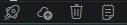

# WebLogic Deployer para VS Code

Extensión para automatizar el ciclo de vida de despliegue de aplicaciones Java J2EE hacia servidores WebLogic 15 (locales o remotos). Permite compilar proyectos con Maven y gestionar el despliegue de artefactos (`.war` o `.ear`) directamente desde Visual Studio Code.

## Características y Uso

Las operaciones de despliegue se realizan sobre el proyecto activo (leyendo el `pom.xml` y la carpeta `target`) y se comunican a través de la API REST de administración de WebLogic.

- **Build & Deploy:** Empaqueta el aplicativo con Maven y realiza el despliegue en WebLogic, posteriormente abre el navegador con el contexto.
- **Deploy:** Realiza únicamente el despliegue del artefacto (`war` o `ear`) del proyecto activo.
- **UnDeploy:** Elimina el despliegue (undeploy) del aplicativo en el servidor WebLogic.
- **Configurar Servidores:** Interfaz para registrar múltiples servidores WebLogic globalmente en el IDE.

## Ejecucion 
- Comandos  `Shift + Alt + P`
- Botones  

- Atajos de Teclado

## Atajos de Teclado (Shortcuts)

Para agilizar el flujo de trabajo, se han configurado atajos de teclado utilizando un acorde de teclas. Primero debes presionar `Alt + W` (o `Cmd + Alt + W` en Mac), soltar, y luego presionar la letra correspondiente a la acción:

| Comando | Windows / Linux | macOS |
| :--- | :--- | :--- |
| **Build & Deploy** | `Alt + W`, luego `B` | `Cmd + Alt + W`, luego `B` |
| **Deploy** | `Alt + W`, luego `D` | `Cmd + Alt + W`, luego `D` |
| **UnDeploy** | `Alt + W`, luego `U` | `Cmd + Alt + W`, luego `U` |
| **Terminal Log** | `Alt + W`, luego `T` | `Cmd + Alt + W`, luego `T` |
| **Configurar Servidores** | `Alt + W`, luego `C` | `Cmd + Alt + W`, luego `C` |

*Nota: Los comandos de despliegue solo se activan si tienes un proyecto abierto en el espacio de trabajo.*

## Configuración de Servidores

Puedes configurar uno o más servidores WebLogic ejecutando el comando **WebLogic: Configurar Servidores** (o usando su atajo de teclado). 

La configuración acepta el parámetro `target` para especificar a qué servidor o clúster se va a desplegar (el valor por defecto es `AdminServer`).

Ejemplo de configuración en tu `settings.json`:

```json
"weblogic.servers": [
    {
        "name": "Servidor Desarrollo",
        "host": "192.168.1.100",
        "port": 7001,
        "username": "weblogic",
        "password": "password123",
        "target": "AdminServer",
        "isDefault": true,
        "openBrowser":true,
        "logPath":"/u01/oracle/user_projects/domains/base_domain/servers/AdminServer/logs/AdminServer.log",
        "containerName": "wls15generic"

    },
    {
        "name": "Cluster Pruebas",
        "host": "10.0.0.50",
        "port": 7001,
        "username": "weblogic",
        "password": "password123",
        "target": "TestCluster",
        "isDefault": false
    }
]
```


# Guía de Compilación, Empaquetado e Instalación

Si estás desarrollando o modificando el código fuente de esta extensión, sigue estos pasos para prepararla, empaquetarla y usarla:

## 1. Instalación de Dependencias

Asegúrate de estar en la raíz de tu proyecto en la terminal y ejecuta los siguientes comandos para instalar las dependencias necesarias:


 

```bash
# Instalar dependencias base del proyecto
npm install

# Instalar la librería para parsear el archivo pom.xml
npm install fast-xml-parser

# Instalar la herramienta oficial de empaquetado de VS Code (vsce) globalmente
npm install -g @vscode/vsce

```

## 2. Compilación y Corrección de Formato (Lint)

Es común que el linter de VS Code (ESLint) detecte advertencias por reglas de estilo (como faltas de llaves `{}` en condicionales `if`). Para corregir el código automáticamente antes de compilar, ejecuta:

```bash
npm run lint -- --fix

```

## 3. Empaquetado

Asegúrate de tener un campo `publisher` configurado en tu archivo `package.json` y de haber guardado tu archivo `README.md`. Para generar el archivo instalable de la extensión, ejecuta:

```bash
vsce package

```

Esto creará un archivo con la extensión `.vsix` en tu directorio actual (por ejemplo, `weblogic-deployer-0.0.1.vsix`).

## 4. Instalación

Puedes instalar el archivo `.vsix` recién generado de dos formas:

### Opción A: Vía Terminal

Ejecuta el siguiente comando apuntando al archivo generado:

```bash
code --install-extension weblogic-deployer-0.0.1.vsix

```

### Opción B: Vía Interfaz Gráfica (VS Code)

1. Ve a la vista de **Extensiones** en VS Code presionando `Ctrl+Shift+X`.
2. Haz clic en el menú de los tres puntos (`...`) ubicado en la esquina superior derecha del panel de extensiones.
3. Selecciona la opción **"Install from VSIX..."**.
4. Localiza en tu sistema el archivo generado y selecciónalo para instalar.


